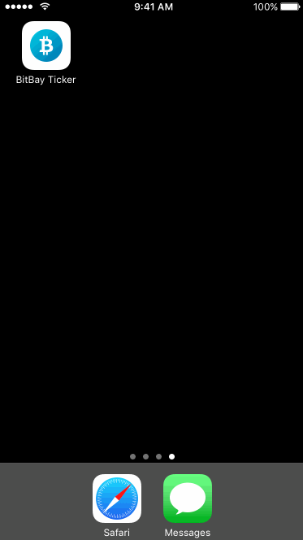

# BitBay Ticker (iOS)


[](https://travis-ci.org/albinekcom/BitBay-Ticker-iOS)

BitBay Ticker for iOS devices.

<p align="center">
  
</p>

## Technical aspects

This application uses [RxSwift](https://github.com/ReactiveX/RxSwift).

## Usage

Clone this repository, execute `carthage update --platform iOS` and open `BitBay-Ticker.xcodeproj`.

```bash
$ git clone https://github.com/albinekcom/BitBay-Ticker-iOS.git
$ cd BitBay-Ticker-iOS
$ carthage update --platform iOS
$ open BitBay-Ticker.xcodeproj
```

<a href="https://itunes.apple.com/us/app/bitbay-ticker/id1253576340?ls=1&mt=8"></a>
